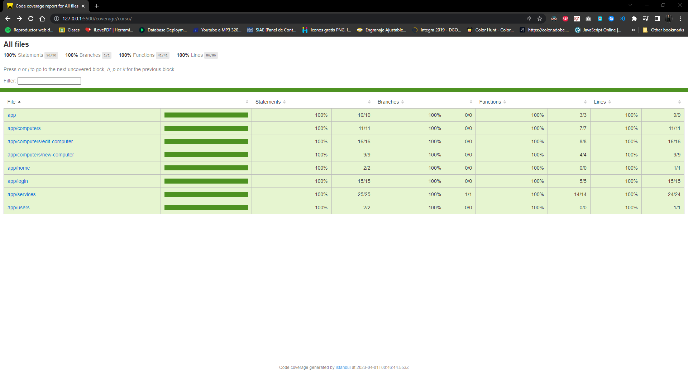
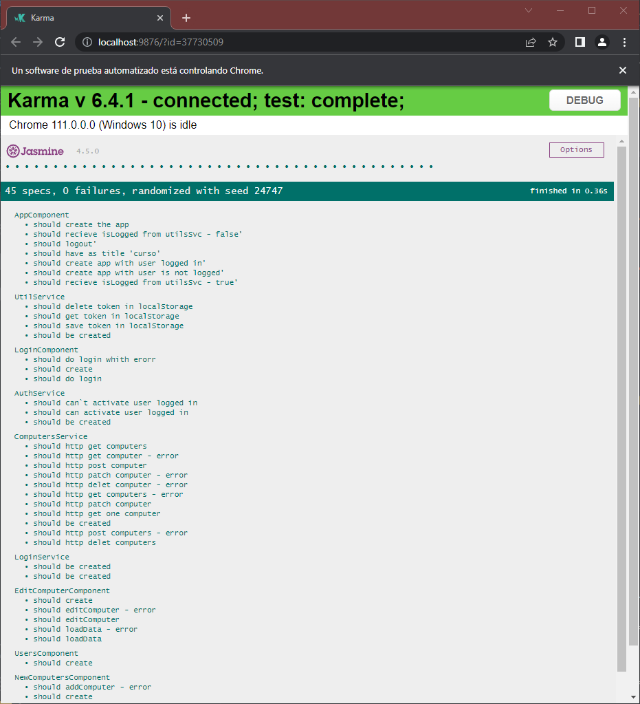
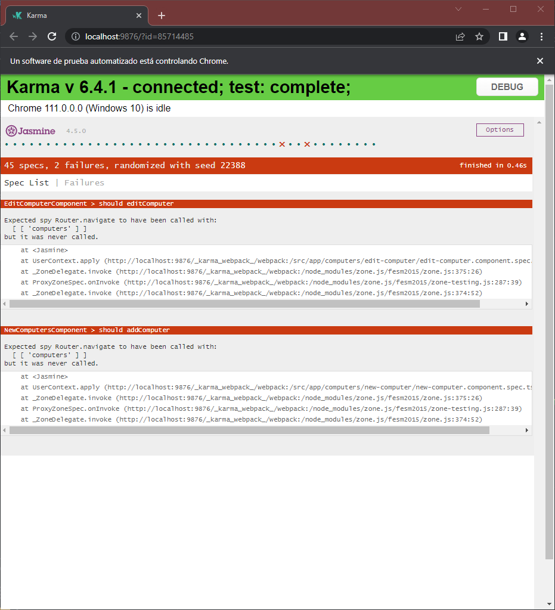

# Cap Angular 10 + Unit Testing

## Actividad
* Realizar las pruebas unitarias faltantes (100%)

***
## Resultados




>Anexe la carpeta **Coverage** por cualquier cosa

***
## Problemas
A pesar de diferentes intentos para solucionarlo, tuve problemas con respecto a los test de **```new-computer.componenet.spec.ts```** y **```edit-computer.componenet.spec.ts```**.

Ya que me sale el siguiente error:


A pesar de eso, si comentaba esas líneas, los resultados en coverage salieron exitosos al 100%.